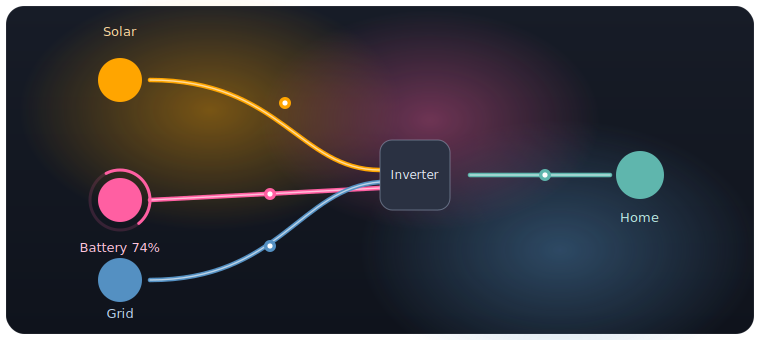

# Solar-Solution

An animated Home Assistant dashboard card for visualizing solar, battery, grid
and load power flow — with an optional **neon glow** theme that makes the card
really stand out. It works with many inverter brands (Sunsynk, Deye, Solis, Lux,
FoxESS, Goodwe, Huawei and more) as long as you have the required sensor data,
and pairs out of the box with the [SolarSynk](examples/solarsynk/) add-on.

[](https://my.home-assistant.io/redirect/hacs_repository/?owner=squid372&repository=Solar-Solution&category=plugin)



## Features

- **Neon glow theme** (opt-in) — glowing flow lines with white-hot cores,
  comet-trail dots, energy pulse waves, pulsing nodes, a frosted-glass card with
  a live ambient aura, charging-aware battery state-of-charge rings, and five
  colour themes. See [below](#neon-glow-theme).
- **Futuristic** card style — a living energy HUD with a glowing reactor-core
  inverter, particle energy flows, a day/night starfield sky, a liquid battery
  cell and a self-powered hero readout. See [below](#futuristic-card-style).
- Four card styles — `futuristic`, `compact`, `lite` or `full`, plus a wide
  16:9 layout.
- Animated power flow with configurable, power-reactive speed (supports inverted
  battery / AUX / grid power).
- Dynamic battery image based on SOC, with optional runtime-to-shutdown estimate.
- Up to **6 MPPT** solar strings and **dual-battery** support.
- Daily totals, self-sufficiency / ratio, temperatures, energy cost and more —
  each toggleable.
- Dynamic colours, custom colours and images, and clickable entities (more-info).
- Per-inverter status and battery messages (Sunsynk, Lux, Goodwe, Solis, …).

## Futuristic card style

A complete reimagining of the power-flow view as a **living energy HUD**. Set
`cardstyle: futuristic` (it reuses the exact same `entities:` mapping as the
other styles):

```yaml
type: custom:solar-solution
cardstyle: futuristic
title: Power Flow
inverter: { model: sunsynk }
battery: { shutdown_soc: 20 }
solar: { mppts: 2 }
grid: {}
entities:
  # …same entity mapping as the other styles…
```

What it shows:

- A glowing **arc-reactor inverter** — a hex backplate, a rotating radar sweep,
  a load gauge, counter-rotating segmented rings, seated bolts and a plasma core
  with the live power readout at the centre.
- Depth layers: a drifting **nebula**, a Tron-style **perspective grid floor**,
  a **top status bar** (day/night, frequency, AC/DC temps, grid voltage, and a
  colour-coded inverter **run status**) and an edge vignette.
- Live **status readouts**: battery **capacity (Ah)** and **efficiency** under the
  cell, and an **ON-GRID / OFF-GRID** badge at the pylon from your grid-signal
  entity.
- **Particle energy** streaming through each conduit — packet count and speed
  scale with power, and direction follows real charge/discharge & import/export.
- A **weather-aware day/night sky**: the sun **becomes a moon at night**, a
  twinkling starfield appears, and clouds / rain / snow / fog roll in to match
  your weather. It auto-detects your `sun.sun` and first `weather.*` entity — or
  point it at specific ones:

  ```yaml
  cardstyle: futuristic
  sun_entity: sun.sun # optional — real day/night & elevation
  weather_entity: weather.forecast_home # optional — clouds/rain/snow/fog
  ```

- A corona **sun** that flares with production.
- The **liquid battery cell** (green→amber→red by SOC, charge bubbles).
- A **glowing home** whose windows brighten with load, plus an energised grid
  pylon.
- A **hero headline** — e.g. `94% SELF-POWERED · +1.2 kW exporting` — and chips
  for daily totals and inverter temps.

It honours `prefers-reduced-motion` (particles and spin pause). The `full`,
`lite` and `compact` styles are unchanged.

## Neon glow theme

An optional, opt-in visual theme. Enable it with:

```yaml
type: custom:solar-solution
cardstyle: full
glow: true
glow_intensity: 3 # 1 (subtle / lighter render) … 5 (intense)
glow_theme: neon # neon | ice | fire | aurora | mono
```

What it adds (all off by default, so the classic look is untouched):

- Glowing flow lines with white-hot cores and comet-trail dots
- **Continuously flowing energy** streaming along every active line, rushing
  faster as power rises
- Energy pulse waves that sweep each active line
- Pulsing node halos and a softly glowing solar node
- A frosted-glass card with a **live ambient aura** tinted to the dominant flow
  (solar / grid / battery) and scaled to system activity
- A charging-aware **battery state-of-charge ring** (both batteries)
- Five colour themes via `glow_theme`

Performance & accessibility: `glow_intensity: 1` renders a lighter "effects-lite"
variant (no comet trails / pulse waves), and `prefers-reduced-motion` is
respected (the moving extras are dropped and CSS animations are paused).

**Preview it locally:** the [`demo/`](demo/) folder contains a standalone,
glow-on-vs-off comparison across all themes — serve it with any static server
(e.g. `npx http-server demo`) and open `index.html`.

## Installation & setup

Getting the card running is **three steps**: install the file, register it as a
dashboard resource, then add the card with your entities. Step 2 is the one most
people miss — if you skip it you'll see **"Custom element doesn't exist:
solar-solution"**.

### Step 1 — Install the card file

**HACS (recommended)**

1. HACS → top-right menu (⋮) → **Custom repositories**.
2. Repository: `https://github.com/squid372/Solar-Solution` — Category: **Dashboard**. Add.
3. Find **Solar-Solution** in HACS → **Download**.

**Manual**

1. Copy `dist/solar-solution.js` into `config/www/solar-solution/` (create the folder).
2. Continue to Step 2 to register it (HACS usually does this for you; manual installs must do it themselves).

### Step 2 — Register the dashboard resource ⚠️ required

Go to **Settings → Dashboards → top-right menu (⋮) → Resources → + Add resource**, then:

| Field | HACS install | Manual install |
| --- | --- | --- |
| **URL** | `/hacsfiles/solar-solution/solar-solution.js` | `/local/solar-solution/solar-solution.js` |
| **Type** | JavaScript Module | JavaScript Module |

> If you don't see the **Resources** tab, enable **Advanced Mode** in your user
> profile (top-left avatar → toggle *Advanced Mode*). After adding the resource,
> do a hard refresh (**Ctrl/Cmd + Shift + R**).

### Step 3 — Add the card

Edit a dashboard → **+ Add Card** → **Manual**, and paste this. **Then change
every `sensor.*` value to your own entity IDs** (find them in
*Developer Tools → States*). This is the only part you must edit:

```yaml
type: custom:solar-solution
cardstyle: full # full | lite | compact
glow: true # optional neon theme — set false for the classic look
inverter:
  model: sunsynk # sunsynk | deye | solis | goodwe | lux | ...
battery:
  shutdown_soc: 20 # required when show_battery is on
solar:
  mppts: 1 # required when show_solar is on — number of PV strings
grid: {}
entities:
  # 👇 REPLACE each sensor.* below with YOUR Home Assistant entity IDs 👇
  inverter_power_175: sensor.inverter_power
  battery_soc_184: sensor.battery_soc
  battery_power_190: sensor.battery_power
  pv1_power_186: sensor.pv1_power
  grid_power_169: sensor.grid_power
```

Don't have solar or a battery? Add `show_solar: false` and/or
`show_battery: false` at the top level to skip those sections (and their
required attributes).

## Use with the SolarSynk add-on

If you use the SolarSynk add-on to pull your inverter data into Home Assistant,
a ready-to-use, pre-mapped card preset (with the glow theme enabled) lives in
[`examples/solarsynk/`](examples/solarsynk/) — replace `YOURSERIAL` and paste it in.

## Troubleshooting

| Symptom | Fix |
| --- | --- |
| **"Custom element doesn't exist: solar-solution"** | The resource (Step 2) isn't registered, or the browser cached the old page. Add the resource, then hard-refresh (Ctrl/Cmd+Shift+R). After an update, append `?v=2` to the resource URL and bump it. |
| **"No battery attributes defined"** | Add a `battery:` section with `shutdown_soc`, or set `show_battery: false`. |
| **"No solar attributes defined" / "include the solar mppts"** | Add a `solar:` section with `mppts: <1-6>`, or set `show_solar: false`. |
| **"Please include the day_… attributes"** | You turned on a `show_daily*` option but didn't map its `day_*` entity. Map it or set the `show_daily*` option back to `false`. |
| **Card loads but values are blank / "unavailable"** | Your `sensor.*` entity IDs are wrong. Check exact IDs in *Developer Tools → States*. |
| **Glow theme looks flat** | It's opt-in: set `glow: true`. It shows best on dark themes. |

## Companion cards

The same resource also registers extra cards you can drop onto a dashboard:

### Energy balance — `custom:solar-solution-grid-balance`

Compares **any two energy values** on a proportional diverging bar. Each side
takes an entity, label and colour — so it does **Solar vs Grid** (energy mix),
**Imported vs Exported**, or anything else.

```yaml
# Solar vs Grid (energy source mix)
type: custom:solar-solution-grid-balance
title: Solar vs Grid
glow: true
left:
  entity: sensor.solarsynkv3_YOURSERIAL_pv_etoday
  label: Solar
  colour: '#ffa500'
right:
  entity: sensor.solarsynkv3_YOURSERIAL_grid_etoday_from
  label: Grid
  colour: '#5490c2'
# show_net: true   # optional: also show (left − right)
```

Shorthand for grid bought vs sold (`import − export = net`) still works:

```yaml
type: custom:solar-solution-grid-balance
title: Grid energy balance
glow: true
import: sensor.solarsynkv3_YOURSERIAL_grid_etotal_from
export: sensor.solarsynkv3_YOURSERIAL_grid_etotal_to
```

### Daily energy summary — `custom:solar-solution-energy-summary`

Today's energy totals (solar / load / charged / discharged / imported /
exported) as proportional bars. Map only the rows you have:

```yaml
type: custom:solar-solution-energy-summary
title: Daily energy
glow: true
solar: sensor.solarsynkv3_YOURSERIAL_pv_etoday
load: sensor.solarsynkv3_YOURSERIAL_load_daily_used
battery_charge: sensor.solarsynkv3_YOURSERIAL_battery_etoday_charge
battery_discharge: sensor.solarsynkv3_YOURSERIAL_battery_etoday_discharge
grid_import: sensor.solarsynkv3_YOURSERIAL_grid_etoday_from
grid_export: sensor.solarsynkv3_YOURSERIAL_grid_etoday_to
```

### Self-sufficiency gauge — `custom:solar-solution-self-sufficiency`

A glowing radial gauge for the share of your load powered by solar + battery
(colour shifts red → amber → green). Either read a `%` sensor directly, or let
it compute from daily load + grid-import energy:

```yaml
type: custom:solar-solution-self-sufficiency
title: Self-sufficiency
glow: true
load: sensor.solarsynkv3_YOURSERIAL_load_daily_used
grid_import: sensor.solarsynkv3_YOURSERIAL_grid_etoday_from
# value: sensor.my_autarky_percent   # alternative: a direct % sensor
# colour: '#5fd07a'                   # optional fixed colour
```

### Battery status — `custom:solar-solution-battery`

A battery glyph with an **animated liquid fill**: the level rises and falls with
your state-of-charge, the surface ripples like real fluid, bubbles rise while
charging, and the liquid **changes colour with SOC** — green when high, amber
around half, red when low.

```yaml
type: custom:solar-solution-battery
title: Battery
glow: true
soc: sensor.solarsynkv3_YOURSERIAL_battery_soc # % — required
power: sensor.solarsynkv3_YOURSERIAL_battery_power # W — drives charging/discharging
# invert_power: false   # flip if charging shows as discharging
voltage: sensor.solarsynkv3_YOURSERIAL_battery_voltage
current: sensor.solarsynkv3_YOURSERIAL_battery_current
temp: sensor.solarsynkv3_YOURSERIAL_battery_temp
# colour: '#33c463'     # optional: force a fixed liquid colour
```

By default the liquid is green at/above 70 %, amber between 30–70 %, and red at
or below 30 %. `prefers-reduced-motion` pauses the waves and hides the bubbles.

### Inverter settings — `custom:solar-solution-inverter`

A clean tile grid of **any inverter settings and readouts** you care about — work
mode, priority/energy mode, solar-sell, max-sell power, output power, frequency,
temperatures, capacity, and so on — with an optional colour-coded **status
badge**. Numeric values are formatted with their unit; text states (like
`selfuse`) are tidied to `Self Use`. Every tile is clickable (opens more-info).

```yaml
type: custom:solar-solution-inverter
title: Inverter
glow: true
status: sensor.solarsynkv3_YOURSERIAL_status # big status badge
# columns: 3              # optional: force a fixed column count
entities:
  - entity: sensor.solarsynkv3_YOURSERIAL_sysworkmode
    label: Work mode
    icon: mdi:cog
  - entity: sensor.solarsynkv3_YOURSERIAL_energymode
    label: Priority
    icon: mdi:flash
  - entity: sensor.solarsynkv3_YOURSERIAL_solarsell
    label: Solar sell
    icon: mdi:cash
  - entity: sensor.solarsynkv3_YOURSERIAL_solarmaxsellpower
    label: Max sell
    icon: mdi:transmission-tower-export
  - entity: sensor.solarsynkv3_YOURSERIAL_inverter_power
    label: Output
    icon: mdi:power-plug
  - entity: sensor.solarsynkv3_YOURSERIAL_load_frequency
    label: Frequency
    icon: mdi:sine-wave
  - entity: sensor.solarsynkv3_YOURSERIAL_inverter_dc_temperature
    label: DC temp
    icon: mdi:thermometer
  - entity: sensor.solarsynkv3_YOURSERIAL_inverter_ac_temperature
    label: AC temp
    icon: mdi:thermometer
  - sensor.solarsynkv3_YOURSERIAL_battery_capacity # shorthand: just the id
```

Each entry can be a bare entity-id string, or an object with optional `label`,
`icon` and `unit` overrides. The grid is responsive (auto-fits to the card
width) unless you set `columns`.

## Configuration

Every option is documented in [`docs/configuration.md`](docs/configuration.md).

## Development

```bash
npm install      # install dependencies
npm run build    # bundle to dist/solar-solution.js
npm run watch    # rebuild on change
```

## License

MIT © 2026 squid372. Built on the open-source
[Sunsynk Power Flow Card](https://github.com/slipx06/sunsynk-power-flow-card) (MIT).
