# Solar-Solution

A **futuristic, animated Home Assistant dashboard card** that renders your solar,
battery, grid and load power flow as a living sci-fi energy HUD — a glowing
reactor orb, energy streaming through glass conduits, a weather-aware day/night
sky, and tap-to-drill-down on every node. It works with many inverter brands
(Sunsynk, Deye, Solis, Lux, FoxESS, Goodwe, Huawei and more) and pairs out of the
box with the [SolarSynk](examples/solarsynk/) add-on.

[](https://my.home-assistant.io/redirect/hacs_repository/?owner=squid372&repository=Solar-Solution&category=plugin)



## Features

- **Living energy HUD** — a clean glowing **reactor orb** at the centre, with
  energy particles streaming through each conduit (count + speed scale with
  power; direction follows real charge/discharge & import/export).
- **Glass node modules** — solar, battery, grid and home each sit in a frosted
  panel with a glowing node-coloured accent bar and rich readouts.
- **Weather-aware day/night sky** — the sun **becomes a moon at night**, a
  starfield appears, and clouds / rain / snow / fog roll in to match your weather
  (auto-detected from `sun.sun` + your `weather.*` entity).
- **Tap anything** — tap a node to open its entity's more-info dialog.
- **Live 24-hour trends** — a battery-SOC trace inside the cell and a load
  sparkline under the home module, drawn from real HA history.
- A **liquid battery cell** (green→amber→red by SOC) and a **prepaid-credit
  badge** that colour-warns as it runs low.
- **Themeable** via `glow_theme` (neon / ice / fire / aurora / mono) with a
  holographic scanline overlay.
- Deep readouts: **up to 6 MPPT** strings, solar-sell + max-sell + lifetime PV,
  battery V / A / temp / capacity / efficiency / SOH, grid signal, inverter run
  status, AC/DC temps, frequency, grid voltage, daily totals and a self-powered
  hero headline.
- Bundled **companion cards** (battery, inverter, daily energy, self-sufficiency,
  solar-vs-grid) — see [below](#companion-cards).
- Honours `prefers-reduced-motion`.

## The card

The power-flow view is rendered as a single **living energy HUD**. A minimal card
looks like this — map your entities and you're done:

```yaml
type: custom:solar-solution
title: Power Flow
glow_theme: neon # neon | ice | fire | aurora | mono
inverter: { model: sunsynk }
battery: { shutdown_soc: 20 }
solar: { mppts: 2 }
grid: {}
entities:
  # 👇 your Home Assistant entity IDs 👇
  battery_soc_184: sensor.battery_soc
  battery_power_190: sensor.battery_power
  pv1_power_186: sensor.pv1_power
  grid_power_169: sensor.grid_power
  inverter_power_175: sensor.inverter_power
```

Use the **visual editor** (the ✏️ on the card) for a clean six-section form —
**Card · Inverter · Solar · Battery · Grid · Home** — covering the entities and
options above, plus the optional sky and extra readouts:

```yaml
sun_entity: sun.sun # real day/night & elevation (optional)
weather_entity: weather.forecast_home # clouds/rain/snow/fog (optional)
entities:
  environment_temp: sensor.outside_temperature # ambient temp in the status bar
  prepaid_units: input_number.prepaid_balance # prepaid credit badge (kWh)
  # …plus per-MPPT power, battery voltage/current/SOH, solar-sell,
  #    max-sell power, lifetime PV, grid signal, AC/DC temps, frequency, …
```

> **Prepaid balance:** since prepaid credit is topped up manually, create a
> **Number helper** (Settings → Devices & Services → Helpers → Number, unit
> `kWh`) and map it to `prepaid_units`. The badge turns amber, then red, as it
> runs low.

Don't have solar or a battery? Add `show_solar: false` and/or `show_battery:
false` to skip those sections. The card honours `prefers-reduced-motion`.

**At night & in bad weather** the sun becomes a moon, stars come out, and the
scene reflects your real flow (here: no solar, battery discharging, grid covering
the shortfall):



**Five colour themes** — `glow_theme` recolours the entire HUD:



## Installation & setup

Getting the card running is **three steps**: install the file, register it as a
dashboard resource, then add the card with your entities. Step 2 is the one most
people miss — if you skip it you'll see **"Custom element doesn't exist:
solar-solution"**.

### Step 1 — Install the card file

**HACS (recommended)**

1. HACS → top-right menu (⋮) → **Custom repositories**.
2. Repository: `https://github.com/squid372/Solar-Solution` — Category: **Dashboard**. Add.
3. Find **Solar-Solution** in HACS → **Download**.

**Manual**

1. Copy `dist/solar-solution.js` into `config/www/solar-solution/` (create the folder).
2. Continue to Step 2 to register it (HACS usually does this for you; manual installs must do it themselves).

### Step 2 — Register the dashboard resource ⚠️ required

Go to **Settings → Dashboards → top-right menu (⋮) → Resources → + Add resource**, then:

| Field | HACS install | Manual install |
| --- | --- | --- |
| **URL** | `/hacsfiles/solar-solution/solar-solution.js` | `/local/solar-solution/solar-solution.js` |
| **Type** | JavaScript Module | JavaScript Module |

> If you don't see the **Resources** tab, enable **Advanced Mode** in your user
> profile (top-left avatar → toggle *Advanced Mode*). After adding the resource,
> do a hard refresh (**Ctrl/Cmd + Shift + R**).

### Step 3 — Add the card

Edit a dashboard → **+ Add Card** → **Manual**, and paste this. **Then change
every `sensor.*` value to your own entity IDs** (find them in
*Developer Tools → States*). This is the only part you must edit:

```yaml
type: custom:solar-solution
glow_theme: neon # neon | ice | fire | aurora | mono
inverter:
  model: sunsynk # sunsynk | deye | solis | goodwe | lux | ...
battery:
  shutdown_soc: 20 # required when show_battery is on
solar:
  mppts: 1 # required when show_solar is on — number of PV strings
grid: {}
entities:
  # 👇 REPLACE each sensor.* below with YOUR Home Assistant entity IDs 👇
  inverter_power_175: sensor.inverter_power
  battery_soc_184: sensor.battery_soc
  battery_power_190: sensor.battery_power
  pv1_power_186: sensor.pv1_power
  grid_power_169: sensor.grid_power
```

Don't have solar or a battery? Add `show_solar: false` and/or
`show_battery: false` at the top level to skip those sections (and their
required attributes).

## Use with the SolarSynk add-on

If you use the SolarSynk add-on to pull your inverter data into Home Assistant,
a ready-to-use, pre-mapped card preset lives in
[`examples/solarsynk/`](examples/solarsynk/) — replace `YOURSERIAL` and paste it in.

## Troubleshooting

| Symptom | Fix |
| --- | --- |
| **"Custom element doesn't exist: solar-solution"** | The resource (Step 2) isn't registered, or the browser cached the old page. Add the resource, then hard-refresh (Ctrl/Cmd+Shift+R). After an update, append `?v=2` to the resource URL and bump it. |
| **"No battery attributes defined"** | Add a `battery:` section with `shutdown_soc`, or set `show_battery: false`. |
| **"No solar attributes defined" / "include the solar mppts"** | Add a `solar:` section with `mppts: <1-6>`, or set `show_solar: false`. |
| **"Please include the day_… attributes"** | You turned on a `show_daily*` option but didn't map its `day_*` entity. Map it or set the `show_daily*` option back to `false`. |
| **Card loads but values are blank / "unavailable"** | Your `sensor.*` entity IDs are wrong. Check exact IDs in *Developer Tools → States*. |
| **HUD accent colour isn't what I want** | Set `glow_theme:` to `neon`, `ice`, `fire`, `aurora` or `mono`. |
| **24-hour trends don't appear** | They load a few seconds after the card opens (one history query) and need `battery_soc_184` / `essential_power` mapped. They refresh every ~5 min. |
| **Prepaid badge is missing** | Map `prepaid_units` to a Number helper (kWh). See [The card](#the-card). |

## Companion cards

The same resource also registers extra cards you can drop onto a dashboard:

### Energy balance — `custom:solar-solution-grid-balance`

Compares **any two energy values** on a proportional diverging bar. Each side
takes an entity, label and colour — so it does **Solar vs Grid** (energy mix),
**Imported vs Exported**, or anything else.

```yaml
# Solar vs Grid (energy source mix)
type: custom:solar-solution-grid-balance
title: Solar vs Grid
glow: true
left:
  entity: sensor.solarsynkv3_YOURSERIAL_pv_etoday
  label: Solar
  colour: '#ffa500'
right:
  entity: sensor.solarsynkv3_YOURSERIAL_grid_etoday_from
  label: Grid
  colour: '#5490c2'
# show_net: true   # optional: also show (left − right)
```

Shorthand for grid bought vs sold (`import − export = net`) still works:

```yaml
type: custom:solar-solution-grid-balance
title: Grid energy balance
glow: true
import: sensor.solarsynkv3_YOURSERIAL_grid_etotal_from
export: sensor.solarsynkv3_YOURSERIAL_grid_etotal_to
```

### Daily energy summary — `custom:solar-solution-energy-summary`

Today's energy totals (solar / load / charged / discharged / imported /
exported) as proportional bars. Map only the rows you have:

```yaml
type: custom:solar-solution-energy-summary
title: Daily energy
glow: true
solar: sensor.solarsynkv3_YOURSERIAL_pv_etoday
load: sensor.solarsynkv3_YOURSERIAL_load_daily_used
battery_charge: sensor.solarsynkv3_YOURSERIAL_battery_etoday_charge
battery_discharge: sensor.solarsynkv3_YOURSERIAL_battery_etoday_discharge
grid_import: sensor.solarsynkv3_YOURSERIAL_grid_etoday_from
grid_export: sensor.solarsynkv3_YOURSERIAL_grid_etoday_to
```

### Self-sufficiency gauge — `custom:solar-solution-self-sufficiency`

A glowing radial gauge for the share of your load powered by solar + battery
(colour shifts red → amber → green). Either read a `%` sensor directly, or let
it compute from daily load + grid-import energy:

```yaml
type: custom:solar-solution-self-sufficiency
title: Self-sufficiency
glow: true
load: sensor.solarsynkv3_YOURSERIAL_load_daily_used
grid_import: sensor.solarsynkv3_YOURSERIAL_grid_etoday_from
# value: sensor.my_autarky_percent   # alternative: a direct % sensor
# colour: '#5fd07a'                   # optional fixed colour
```

### Battery status — `custom:solar-solution-battery`

A battery glyph with an **animated liquid fill**: the level rises and falls with
your state-of-charge, the surface ripples like real fluid, bubbles rise while
charging, and the liquid **changes colour with SOC** — green when high, amber
around half, red when low.

```yaml
type: custom:solar-solution-battery
title: Battery
glow: true
soc: sensor.solarsynkv3_YOURSERIAL_battery_soc # % — required
power: sensor.solarsynkv3_YOURSERIAL_battery_power # W — drives charging/discharging
# invert_power: false   # flip if charging shows as discharging
voltage: sensor.solarsynkv3_YOURSERIAL_battery_voltage
current: sensor.solarsynkv3_YOURSERIAL_battery_current
temp: sensor.solarsynkv3_YOURSERIAL_battery_temp
# colour: '#33c463'     # optional: force a fixed liquid colour
```

By default the liquid is green at/above 70 %, amber between 30–70 %, and red at
or below 30 %. `prefers-reduced-motion` pauses the waves and hides the bubbles.

### Inverter settings — `custom:solar-solution-inverter`

A clean tile grid of **any inverter settings and readouts** you care about — work
mode, priority/energy mode, solar-sell, max-sell power, output power, frequency,
temperatures, capacity, and so on — with an optional colour-coded **status
badge**. Numeric values are formatted with their unit; text states (like
`selfuse`) are tidied to `Self Use`. Every tile is clickable (opens more-info).

```yaml
type: custom:solar-solution-inverter
title: Inverter
glow: true
status: sensor.solarsynkv3_YOURSERIAL_status # big status badge
# columns: 3              # optional: force a fixed column count
entities:
  - entity: sensor.solarsynkv3_YOURSERIAL_sysworkmode
    label: Work mode
    icon: mdi:cog
  - entity: sensor.solarsynkv3_YOURSERIAL_energymode
    label: Priority
    icon: mdi:flash
  - entity: sensor.solarsynkv3_YOURSERIAL_solarsell
    label: Solar sell
    icon: mdi:cash
  - entity: sensor.solarsynkv3_YOURSERIAL_solarmaxsellpower
    label: Max sell
    icon: mdi:transmission-tower-export
  - entity: sensor.solarsynkv3_YOURSERIAL_inverter_power
    label: Output
    icon: mdi:power-plug
  - entity: sensor.solarsynkv3_YOURSERIAL_load_frequency
    label: Frequency
    icon: mdi:sine-wave
  - entity: sensor.solarsynkv3_YOURSERIAL_inverter_dc_temperature
    label: DC temp
    icon: mdi:thermometer
  - entity: sensor.solarsynkv3_YOURSERIAL_inverter_ac_temperature
    label: AC temp
    icon: mdi:thermometer
  - sensor.solarsynkv3_YOURSERIAL_battery_capacity # shorthand: just the id
```

Each entry can be a bare entity-id string, or an object with optional `label`,
`icon` and `unit` overrides. The grid is responsive (auto-fits to the card
width) unless you set `columns`.

## Configuration

Every option is documented in [`docs/configuration.md`](docs/configuration.md).

## Development

```bash
npm install      # install dependencies
npm run build    # bundle to dist/solar-solution.js
npm run watch    # rebuild on change
```

## License

MIT © 2026 squid372. Built on the open-source
[Sunsynk Power Flow Card](https://github.com/slipx06/sunsynk-power-flow-card) (MIT).
